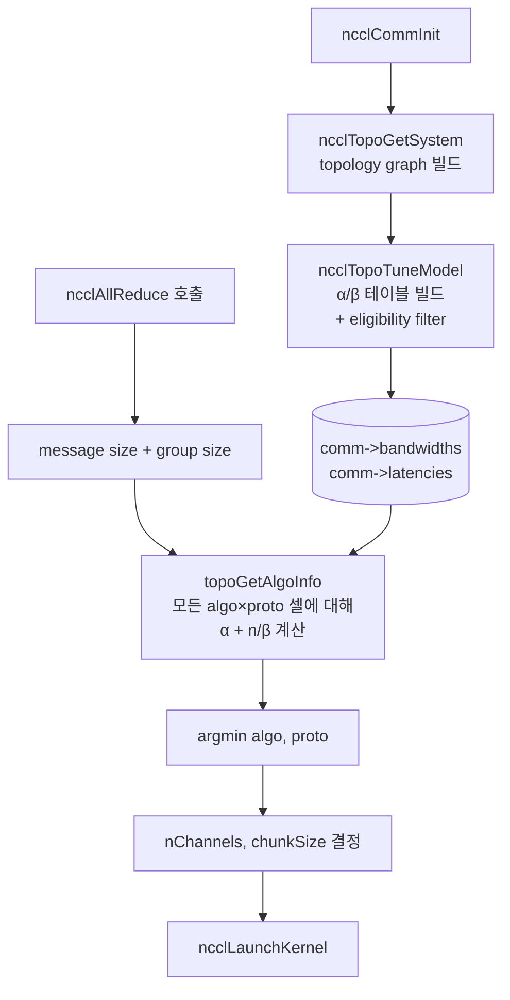

이 글은 [NCCL 과 Communication Collectives](/posts/nccl-collectives/) 의 후속이다. 거기서 정리한 어휘 (8 collective + P2P + 1-sided RMA, 항등식 AR ≡ RS + AG, single-kernel comm + reduction) 를 가정한다.

> 코드 인용과 함수 이름은 NCCL master (2026-04 시점, v2.30) 기준.

## 1. 같은 Collective, 다른 Schedule

"MPI_Reduce 는 tree" 또는 "NCCL 은 ring" 같은 말은 절반만 맞다.

`AllReduce` 같은 collective 의 *의미* (semantics) 는 contract 하나로 정해진다. "모든 rank 의 값을 합쳐 모든 rank 가 결과를 받는다." 그 contract 를 *어떻게* 수행하느냐는 별개의 층위다. ring 으로 굴려도 되고, tree 로 굴려도 되고, NVSwitch multicast 로 한 번에 끝내도 된다. 어느 것이 빠른지는 메시지 크기, rank 수, topology, hardware 가 다 결정한다.

그래서 NCCL 은 collective 한 호출이 들어올 때마다 후보 알고리즘 7 개와 protocol 3 개의 21 개 격자에서 cost model 로 최소 시간 페어를 고른다. 7 × 3 이 다 살아있는 건 아니고 eligibility 가 격자 대부분을 빼고 시작하지만 (예: AllReduce 는 PAT 안 씀, NVLS 는 Simple protocol 만), 핵심 골격은 격자 + argmin 이다.

이 글의 목표는 그 격자가 어떻게 만들어지고, 호스트가 사용자의 tensor 크기를 보고 어떤 (algorithm, protocol) 을 고르는지를 NCCL master 코드로 따라가는 것.

## 2. αβγ Cost Model

Hockney 의 통신 비용 모델은 한 메시지의 시간을 세 항으로 쪼갠다.

- $\alpha$: 메시지 한 번 보내는 startup latency. RTT 비슷. 마이크로초 단위.
- $\beta$: byte 당 wire 전송 비용. 단위 1/bandwidth.
- $\gamma$: byte 당 reduction 연산 비용. 덧셈 같은 거. 보통 $\beta$ 보다 작아 무시되기도 한다.

$n$ byte 메시지 한 번 = $\alpha + n\beta$. Reduction 포함이면 $\alpha + n\beta + n\gamma$. 이 글의 모든 식이 이 변수로 적힌다.

알고리즘 분석에서 보통 두 한계가 갈린다.

- **Latency-bound**. 메시지가 작아 $n\beta$ 가 무시될 만하면 비용이 step 수 × $\alpha$ 로 결정. 이 영역에서는 step 수 적은 알고리즘 ($\log p$) 이 이긴다.
- **Bandwidth-bound**. 메시지가 커서 $n\beta$ 가 지배하면 step 수보다 *총 송신 byte* 가 중요. 모든 link 를 동시에 활용하는 알고리즘이 이긴다.

알고리즘 선택의 본질은 이 둘 사이 어디에 있느냐다.

## 3. 세 가지 Schedule 가족

Collective 를 굴리는 방법의 부모 클래스가 셋 있다. 거의 모든 구현이 이 변종.

### 3.1 Tree

부모-자식 구조로 partial result 를 위로 모으거나 (reduce) 아래로 뿌린다 (broadcast).

- Depth $O(\log p)$. Step 수 적음.
- Naive tree AllReduce: $T \approx 2 \log p \cdot (\alpha + n\beta + n\gamma)$.
- 단점: tree 의 internal node 는 자식 수만큼 송수신, leaf 는 한 번. 부하가 비대칭.

대표 변종으로 binomial, binary, k-nomial. Internal/leaf 부하 비대칭은 §5.2 Double Binary Tree 가 푼다.

### 3.2 Ring

각 rank 가 두 이웃과만 chunk 를 파이프라인.

- Step 수 $O(p)$. AllReduce 면 $2(p-1)$.
- Per-rank 송수신 byte $\approx 2n$ (메시지 크기와 같은 상수).
- 모든 link 가 동시에 활성화되어 wire bandwidth 를 끝까지 짠다.

Ring AllReduce 는 RS + AG 두 phase 로 구성된다 (①편 §3, §5.1).

$$T_{\text{ring}} = 2(p-1)\alpha + 2 \cdot \frac{p-1}{p} n\beta + \frac{p-1}{p} n\gamma$$

큰 $p$ 에서 $\alpha$ 항이 선형으로 늘어나지만 (latency 약점), $\beta$ 항은 $2n$ 에 가까운 상수로 수렴 (*bandwidth optimal*).

### 3.3 Butterfly / Recursive Doubling

Round $k$ 에서 XOR $2^k$ 떨어진 peer 와 교환. 파트너가 1, 2, 4, 8 식으로 두 배씩.

- Step 수 $\log p$.
- 매 round 에서 partial sum 의 coverage 가 두 배씩 증가.
- AllReduce: $T \approx \log p \cdot \alpha + n \log p \cdot \beta + n \log p \cdot \gamma$ (medium message).

Power-of-two rank 에서 깔끔. Non-power-of-two 면 Bruck 변형이 필요.

### 3.4 8-rank AllReduce 로 비교

같은 AllReduce 를 세 가족이 어떻게 다르게 굴리는지.

```
Tree (binomial)              Butterfly (recursive doubling)
Reduce up:                   Round 1 (XOR 1):
  R1: 1→0, 3→2, 5→4, 7→6       0↔1, 2↔3, 4↔5, 6↔7
  R2: 2→0, 6→4                Round 2 (XOR 2):
  R3: 4→0  → rank 0 = sum       0↔2, 1↔3, 4↔6, 5↔7
Broadcast down:              Round 3 (XOR 4):
  R4: 0→4                      0↔4, 1↔5, 2↔6, 3↔7
  R5: 0→2, 4→6                결과: 모두 sum
  R6: 0→1, 2→3, 4→5, 6→7

Ring (0→1→2→...→7→0)
RS phase: 7 step, AG phase: 7 step → 모두 sum
```

| 가족 | 라운드 | per-rank wire-traffic |
|---|---|---|
| Tree (binomial) | $2 \log p = 6$ | $\sim n \log p$ |
| Butterfly | $\log p = 3$ | $\sim n \log p$ |
| Ring | $2(p-1) = 14$ | $\sim 2n$ |

Rank 많고 메시지 작으면 3-6 round 쪽이 유리. 메시지 크면 14 step 이어도 ring 이 이긴다. Ring 의 per-rank wire-traffic 이 $O(n)$ 으로 작아 link bandwidth 를 끝까지 쓰기 때문.

## 4. NCCL 한눈에

### 4.1 Algorithm 7 종

```c
// src/include/device.h 발췌
const char* ncclAlgoStr[NCCL_NUM_ALGORITHMS] = {
  "Tree", "Ring", "CollNetDirect", "CollNetChain", "NVLS", "NVLSTree", "PAT"
};
```

| Algorithm | 핵심 구조 | 적용 collective | 비고 |
|---|---|---|---|
| `Ring` | nearest-neighbor pipeline | 거의 모든 collective | per-rank traffic $\sim 2n$ |
| `Tree` | Double Binary Tree (§5.2) | AllReduce 만 | tree latency + ring BW |
| `CollNetDirect` / `CollNetChain` | NVIDIA SHARP (in-network reduce) | AllReduce, RS, AG | IB SHARP NIC 필요 |
| `NVLS` | NVSwitch multicast + reduce | AllReduce 등 | Hopper+, NVSwitch 필요 |
| `NVLSTree` | NVLS + multi-node tree | AllReduce | 2 노드 이상 |
| `PAT` | Parallel Aggregated Trees (Bruck 변형) | AllGather, ReduceScatter | 2.23+, 1-GPU/노드 |

Eligibility 가 어떤 collective 에 어떤 algorithm 이 후보인지를 일찍 자른다 (`src/graph/tuning.cc::ncclTopoTuneModel`):

```c
// src/graph/tuning.cc 발췌
if ((coll == ncclFuncBroadcast || coll == ncclFuncReduce) && a != NCCL_ALGO_RING) continue;
if ((coll == ncclFuncReduceScatter || coll == ncclFuncAllGather)
    && a != NCCL_ALGO_PAT && a != NCCL_ALGO_RING
    && a != NCCL_ALGO_NVLS && a != NCCL_ALGO_COLLNET_DIRECT) continue;
if (coll == ncclFuncAllReduce && a == NCCL_ALGO_PAT) continue;
```

요지: Broadcast / Reduce 는 Ring 만, AllGather / ReduceScatter 는 {Ring, PAT, NVLS, CollNet_Direct}, AllReduce 는 PAT 빼고 다.

### 4.2 Topology Pattern 6 종

알고리즘과 별개로 그래프 search 단계 (`src/graph/search.cc::ncclTopoCompute`) 에서 보는 topology pattern 이 따로 있다. 같은 Tree algorithm 이라도 그 안에서 NIC 트래픽을 어떻게 분산할지 결정한다.

```c
// src/include/graph.h 발췌
#define NCCL_TOPO_PATTERN_BALANCED_TREE 1   // tree parent + 자식 1 = GPU A, 자식 2 = GPU B
#define NCCL_TOPO_PATTERN_SPLIT_TREE 2      // tree parent = GPU A, 자식들 = GPU B
#define NCCL_TOPO_PATTERN_TREE 3            // 모든 NIC 트래픽이 같은 GPU
#define NCCL_TOPO_PATTERN_RING 4
#define NCCL_TOPO_PATTERN_NVLS 5
#define NCCL_TOPO_PATTERN_COLLNET_DIRECT 6
```

BALANCED / SPLIT 은 NIC traffic 을 두 GPU 에 나눠 PCIe / NVLink 병목을 푸는 변종. Tree 가 골라지면 그 안에서 graph search 가 이 셋 중 어느 pattern 이 가장 균형 있는지 따로 본다.

### 4.3 Protocol 3 종

같은 algorithm 도 wire format 이 셋. data:flag 비율이 다르다.

| Protocol | Cache line | data 효율 | 적합 |
|---|---|---|---|
| `LL` | 8B (4B data + 4B flag) | 50% | 짧은 메시지, latency |
| `LL128` | 128B (120B data + 8B flag) | 93.75% | NVLink intra-node 중간 메시지 |
| `Simple` | full data + 별도 fence | ~100% | 큰 메시지, throughput |

LL / LL128 의 핵심: data 옆에 flag 를 같이 보내서 receiver 가 단일 word load 로 ready 폴링 가능. PCIe doorbell 따로 안 받음. 그 대가가 효율 손실. LL128 은 NVLink cache line 단위 (128B) 를 그대로 활용해서 line 당 8B 만 flag 에 양보. 그래서 NVLink intra-node 에서 sweet spot. Enable 의 정확한 조건은 §6.

## 5. Algorithm Deep-dive

### 5.1 Ring AllReduce

①편 §5.1 에서 코드까지 봤으므로 cost model 만 정리.

Phase 1 ReduceScatter ($p-1$ step), phase 2 AllGather ($p-1$ step). Per-step chunk size $K/p$. 총 step $2(p-1)$, per-rank 송신 byte $\approx 2K(p-1)/p$.

$$T_{\text{ring}}(K) = 2(p-1)\alpha + \frac{2(p-1)}{p} K\beta + \frac{p-1}{p} K\gamma$$

큰 $K$ 에서 $\beta$ 항이 $2K\beta$ 로 수렴. AllReduce 의 정보 이론적 하한 ($2K$, 자기 데이터 한 번 내보내고 결과 한 번 받기) 을 그대로 달성. 이게 ring 이 *bandwidth-optimal* 인 의미.

NCCL 은 ring 을 multi-channel 로 굴린다. ①편 §5.0 의 channel 모델 그대로. `ncclBuildRings` (`src/graph/rings.cc`) 가 channel 마다 독립 ring 을 만들고, kernel grid 가 channel 개수만큼.

### 5.2 Double Binary Tree (NCCL 2.4+)

순진한 binary tree 의 약점은 internal node 부하 비대칭. Power-of-two binary tree 에서 root 와 internal 들은 자식 수만큼 송수신, leaf 는 한 번. 깊이 $\log p$ 라도 internal 에 부하가 쏠려 bandwidth 를 못 채운다.

NCCL 2.4 가 이걸 *complementary 한 binary tree 두 개*로 푼다 (Sanders, Speck, Träff 2007).

핵심 trick.

- Tree A 에서 rank $r$ 이 internal 이면, tree B 에서는 leaf 가 되도록 두 tree 를 짠다.
- Payload 를 반씩 두 tree 에 태우면 모든 rank 의 송수신 byte 가 균일.
- 결과: tree latency $\log p$ + ring 급 bandwidth.

코드는 짝수면 mirror, 홀수면 shift (`src/graph/trees.cc::ncclGetDtree`).

```c
// src/graph/trees.cc 발췌 (요지)
ncclResult_t ncclGetDtree(int nranks, int rank,
    int* s0, int* d0_0, int* d0_1, int* parentChildType0,
    int* s1, int* d1_0, int* d1_1, int* parentChildType1) {
  ncclGetBtree(nranks, rank, s0, d0_0, d0_1, parentChildType0);   // Tree A
  if (nranks % 2 == 1) {
    int shiftrank = (rank-1+nranks) % nranks;                     // shift by 1
    int u, d0, d1;
    ncclGetBtree(nranks, shiftrank, &u, &d0, &d1, parentChildType1);
    *s1   = u  == -1 ? -1 : (u +1) % nranks;
    *d1_0 = d0 == -1 ? -1 : (d0+1) % nranks;
    *d1_1 = d1 == -1 ? -1 : (d1+1) % nranks;
  } else {                                                         // mirror: r → nranks-1-r
    int u, d0, d1;
    ncclGetBtree(nranks, nranks-1-rank, &u, &d0, &d1, parentChildType1);
    *s1   = u  == -1 ? -1 : nranks-1-u;
    *d1_0 = d0 == -1 ? -1 : nranks-1-d0;
    *d1_1 = d1 == -1 ? -1 : nranks-1-d1;
  }
  return ncclSuccess;
}
```

Cost model 에서도 "두 tree 가 bandwidth 를 반씩" 이 그대로 박혀있다.

```c
// src/graph/tuning.cc 발췌 — Tree AllReduce latency
if (a == NCCL_ALGO_TREE && coll == ncclFuncAllReduce) {
  comm->latencies[coll][a][p] +=
    2 * ((nRanks/nNodes - 1) * intraLat + log2i(nNodes) * interLat);
}
```

`2 ×` 의 의미. Ring AllReduce 가 RS + AG 두 phase 인 것처럼, tree AllReduce 도 reduce-up + broadcast-down 두 phase. 한 phase 의 latency 가 (intra-node leg) + (inter-node 트리 $\log_2 N$) 이라 그게 두 배.

### 5.3 PAT — Parallel Aggregated Trees (NCCL 2.23+)

Ring AllGather 의 latency 가 $(p-1)\alpha$ 로 큰 $p$ 에서 선형으로 늘어난다는 게 PAT 이 푸는 문제. Bruck 의 recursive-doubling 변형이 base, 거기에 NCCL 만의 producer/worker kernel 구조가 얹힌다.

#### 5.3.1 Enable 조건이 좁다

PAT 가 잘 안 보이는 이유. `ncclPatEnable` (`src/graph/tuning.cc:209`) 가 세 조건을 다 요구한다.

```c
// src/graph/tuning.cc 발췌
NCCL_PARAM(PatEnable, "PAT_ENABLE", 2);
static int ncclPatEnable(struct ncclComm* comm) {
  int patEnable = ncclParamPatEnable();
  if (comm->minCompCap < 60) return 0;             // SM60+ 필요 (CUDA atomics)
  if (patEnable != 2) return patEnable;
  if (comm->nNodes != comm->nRanks) return 0;      // 1 GPU per node 만
  if (comm->netDeviceType != NCCL_NET_DEVICE_HOST) return 0;
  return 1;
}
```

특히 `nNodes == nRanks` 가 결정적. PAT 는 *1 GPU per node* 클러스터 전용. 노드 안에 GPU 가 여럿이면 (8-GPU H100 머신처럼) PAT 는 enable 안 된다. 이게 PAT 를 본 적 없다는 사람이 많은 이유.

언제 의미 있나. Scale-out 1-GPU/노드 클러스터, irregular topology (NVSwitch 없는 환경), AllGather / ReduceScatter 를 자주 부르는 워크로드. NCCL 2.23 release note 가 large-scale GPU 클러스터 (수천 노드) 에서의 의미를 강조한다.

#### 5.3.2 Cost

```c
// src/graph/tuning.cc 발췌
if (a == NCCL_ALGO_PAT
    && (coll == ncclFuncAllGather || coll == ncclFuncReduceScatter)) {
  comm->latencies[coll][a][p] +=
    log2i(nNodes) * (interLat / 3.5)
    + nRanks * 2.8;  // Still a linear part; hopefully we'll manage to remove it at some point.
}
```

식은 $\log p \cdot \frac{\alpha_{\text{inter}}}{3.5} + p \cdot 2.8$. 첫 항이 Bruck 의 log-step 부분, 둘째 항이 아직 남은 linear part. 코드 주석 ("hopefully we'll manage to remove it") 이 NCCL 도 이 linear term 을 미완성으로 본다는 걸 알려준다.

#### 5.3.3 Kernel — producer 1 + worker n

여기가 PAT 의 흥미로운 부분. 같은 CUDA block 안에서 thread 한 개가 알고리즘을 진행하고, 나머지가 데이터를 옮긴다.

```c
// src/device/all_gather.h 발췌 (NCCL_ALGO_PAT, 요지)
struct ncclPatShmem* shmem = (struct ncclPatShmem*)ncclScratchForWarp(0);

if (tid == nworkers) {
  // 알고리즘 thread 1 개. 다음 step 의 source/dst/size 를 shmem 에 push
  PatAGAlgorithm<T> patAlgo(chunkCount*sizeof(T), NCCL_STEPS, ...);
  int step = 0;
  while (1) {
    struct ncclPatStep* ps = shmem->patSteps + (step % NCCL_SHMEM_PAT_STEPS);
    cuda::atomic_ref<int, cuda::thread_scope_block> poll(ps->flags);
    while (poll.load(cuda::memory_order_acquire) != 0) pollCount++;
    patAlgo.getNextOp(ps);
    if (ps->last == 2) break;
    step++;
  }
} else if (tid < nworkers) {
  // worker thread n 개. shmem 의 step descriptor 보고 실제 copy
  Primitives<T, RedOp, FanSymmetric<1>, 0, Proto, 0> prims(..., primsModePatAg);
  int step = group;
  while (1) {
    struct ncclPatStep* ps = shmem->patSteps + (step % NCCL_SHMEM_PAT_STEPS);
    cuda::atomic_ref<int, cuda::thread_scope_block> poll(ps->flags);
    while (poll.load(cuda::memory_order_acquire) == 0) pollCount++;
    prims.patCopy(ps, shmem);
    if (tidInGroup == 0) poll.store(0, cuda::memory_order_release);
    if (last) break;
    step += nGroups;
  }
}
```

읽어내야 할 점.

- 알고리즘 진행 (다음 step 어디로 가나) 과 데이터 이동을 *같은 kernel 안에서 다른 thread* 가 동시에 한다.
- Algorithm thread 가 한 step 앞서 plan 을 적재해두면, worker 가 이전 step 의 copy 를 진행하는 동안 다음 step 이 준비된다 (slot pipelining).
- ReduceScatter 용 PAT 은 `src/device/reduce_scatter.h` 에 같은 구조. `prims.patCopy` 만 `prims.patReduce` 로 바뀐다.

이 producer / worker 분리가 PAT 의 latency 를 더 줄이는 trick. log-step 알고리즘이라도 매 step 마다 host 가 launch 하면 launch overhead 가 누적되는데, NCCL 은 single-kernel 안에서 step 진행을 통제해 그 overhead 를 0 으로.

### 5.4 NVLS / NVLS_TREE

Hopper SXM (NVSwitch 4) 에서 가능한 in-switch reduction. NVSwitch 가 multicast + reduce 를 hardware 로 처리하므로 GPU 가 한 번 보내면 switch 가 나머지를 한다.

```c
// src/graph/tuning.cc 발췌
static const float nvlsEfficiency[NCCL_NUM_COMPCAPS] = {
  0.0f,   // Volta    — NVLS 미지원
  0.0f,   // Ampere   — NVLS 미지원
  0.85f,  // Hopper   — 85%
  0.74f,  // Blackwell
};
```

조건.

- Hopper / Blackwell GPU (compcap 9.0 / 10.0).
- NVSwitch 노드 (`system->nodes[NVS].count > 0`).
- 채널 ≥ 2 개.
- 단일 노드면 `NVLS`, 2 노드 이상이면 `NVLS_TREE` (multi-node tree 가 NVLS 위에 얹힘).

Cost 식이 단순한 것도 NVLS 의 특징.

```c
// src/graph/tuning.cc 발췌 — NVLS latency
if (a == NCCL_ALGO_NVLS) {
  comm->latencies[coll][a][p] = intraLat;
  if (nNodes > 1) comm->latencies[coll][a][p] += interLat;
}
```

`α × 1` (intra) + 옵션으로 `α × 1` (inter). $p$ 가 식에서 사라진다. 이게 NVSwitch multicast 의 본질. 8-GPU H100 / H200 NVSwitch 머신에서 큰 AllReduce 는 거의 자동으로 NVLS 가 골라진다.

### 5.5 CollNet Direct / Chain

InfiniBand SHARP (Scalable Hierarchical Aggregation and Reduction Protocol) 활용. NIC 와 IB switch 가 reduce 를 hardware 로 처리.

```c
// src/graph/tuning.cc 발췌
} else if (a == NCCL_ALGO_COLLNET_DIRECT) {
  comm->latencies[coll][a][p] +=
    2 * (std::min(1, (nRanks/nNodes-1)) * intraLat + (nRanks/nNodes-1) * 0.4) + interLat;
} else if (a == NCCL_ALGO_COLLNET_CHAIN) {
  comm->latencies[coll][a][p] += 2 * (nRanks/nNodes-1) * intraLat + interLat;
}
```

Inter-node 비용이 `interLat × 1` 한 번. 노드 사이 reduction 이 switch 안에서 끝나기 때문. 조건은 hardware 가 SHARP 를 지원하고 NCCL 이 인식한 IB SHARP NIC 가 있어야 한다는 것. HPC 클러스터의 InfiniBand 환경에서 의미 있고, RoCE 나 GPU 직결 NVLink 환경에서는 NVLS 가 더 자주 골라진다.

## 6. Protocol Simple / LL / LL128

§4.3 의 표를 코드까지 늘리면.

```c
// src/device/primitives.h 발췌
struct ProtoSimple {  // NCCL_PROTO_SIMPLE = 2
  __device__ static int calcBytePerStep() {
    return ncclShmem.comm.buffSizes[NCCL_PROTO_SIMPLE]/NCCL_STEPS;
  }
};
struct ProtoLL {      // NCCL_PROTO_LL = 0
  // 16B line = 8B data + 8B flag → 50%
  __device__ static int calcBytePerStep() {
    return ncclShmem.comm.buffSizes[NCCL_PROTO_LL]/NCCL_STEPS/2;
  }
};
struct ProtoLL128 {   // NCCL_PROTO_LL128 = 1
  // 128B NVLink line 중 120B data → 93.75%
  __device__ static int calcBytePerStep() {
    return (ncclShmem.comm.buffSizes[NCCL_PROTO_LL128]/NCCL_STEPS)
           * NCCL_LL128_DATAELEMS / NCCL_LL128_LINEELEMS;
  }
};
```

LL128 은 atomicity 가 보장되는 transport 에서만 enable 된다. 조건이 꽤 까다롭다 (`src/graph/tuning.cc:486`).

```c
// src/graph/tuning.cc 발췌 — LL128 enable gating
if (pEnable == 2 && p == NCCL_PROTO_LL128) {
  pEnable = 1;
  if (ncclParamLl128C2c() && minCompCap >= 90) {
    pEnable &= (graphs[a]->typeInter <= PATH_PXN);  // Hopper+ + LL128_C2C=1 면 PXN 까지
  } else {
    pEnable &= (graphs[a]->typeInter <= PATH_PXB);  // 기본은 PXB 까지
  }
  pEnable &= (graphs[a]->typeIntra <= PATH_NVB);    // intra 는 NVLink 만
  pEnable &= (minCompCap == maxCompCap || minCompCap >= 90);  // compcap uniform 또는 ≥ Hopper
  pEnable &= !(minCompCap < 70 || ...);
}
```

읽으면.

- Intra-node 는 NVLink-Bridge 이하 (즉 NVLink 직결만). PCIe 거치면 LL128 안 씀.
- Inter-node 는 PXB 이하 (NIC 가 GPU 와 같은 PCIe switch). Hopper+ + `NCCL_LL128_C2C=1` 이면 PXN 까지 허용.
- Compute capability 가 uniform 이거나 모두 ≥ Hopper.

PATH 타입의 정확한 의미는 ①편 §4.5 참고. 가까운 순서: NVL > NVB > C2C > PIX > PXB > P2C > PXN > PHB > SYS > NET.

## 7. Selection 머신

호스트가 사용자의 collective 호출 (예: `ncclAllReduce(buf, ..., count, dtype, op, comm, stream)`) 을 받아 어떤 (algo, proto, nChannels, chunkSize) 로 launch 할지 결정하는 흐름. 두 단계로 나뉜다.

### 7.1 Init: α/β 테이블 빌드

`ncclTopoTuneModel` (`src/graph/tuning.cc:238`) 이 communicator init 시 모든 (collective, algorithm, protocol) 셀에 대해 두 표를 채운다.

- `comm->bandwidths[coll][algo][proto]` (GB/s)
- `comm->latencies[coll][algo][proto]` (µs)

bandwidth 는 topology 에서 BFS-측정한 link bandwidth + nvlsEfficiency / collnetEfficiency 같은 보정 인자로 시작해서, 알고리즘별 step 수와 $(p-1)/p$ 계수로 깎아 내려간다. Latency 는 baseLat + hwLat 의 합 + 알고리즘별 추가 항 (§5 의 수식들).

### 7.2 baseLat / hwLat verbatim

이 표가 모든 cost 계산의 입력이다. mesh_device 가 원한 "넘버 딱딱" 의 그 numbers.

```c
// src/graph/tuning.cc — baseLatencies (µs, [algo][proto] = [LL, LL128, Simple])
{
  {  6.8, 14.0,  8.4 }, {  6.6, 14.0,  8.4 },  // Tree, Ring
  {    0,    0,    0 }, {    0,    0,    0 },  // CollNetDirect, CollNetChain
  {    0,    0,    0 }, {    0,    0,    0 },  // NVLS, NVLSTree
  {  8.0,  8.0,  8.0 }                         // PAT
};

// hwLatencies[hw][algo][proto]  (µs, hw = NVLINK / PCI / NET)
{
/* NVLINK */
{ { 0.6,  1.25, 4.0 }, { 0.6,  1.9,  3.4 },   // Tree, Ring
  {   0,     0, 3.7 }, {   0,    0,  2.8 },   // CollNetDirect, Chain
  {   0,     0,  25 }, {   0,    0,   25 },   // NVLS, NVLSTree
  {   0,     0, 4.0 }                       },// PAT
/* PCI */
{ { 1.0,  1.9,  4.0 }, { 1.0,  2.5,  5.7 },
  {   0,     0, 3.7 }, {   0,    0,  2.8 },
  {   0,     0,   0 }, {   0,    0,    0 },
  {   0,     0, 4.0 }                       },
/* NET */
{ { 5.0,  8.5,  14  }, { 2.7,  4.0, 14.0 },
  {   0,     0,  31 }, {   0,    0,   30 },
  {   0,     0,  18 }, {   0,    0, 20.9 },
  {   0,     0,  14 }                       },
};
```

읽는 법. `hwLatencies[NCCL_HW_NET][NCCL_ALGO_RING][NCCL_PROTO_SIMPLE] = 14.0` µs. NIC 한 hop 의 ring Simple latency 가 14 µs. 같은 ring 도 NVLink 면 3.4 µs 로 4 배 빠르다.

이 값들이 §8 numerical example 의 입력.

### 7.3 Eligibility filter

§4.1 / §4.2 / §6 의 조건들을 코드로 한 번에 보면.

```c
// src/graph/tuning.cc::ncclTopoTuneModel 발췌
for (int a=0; a<NCCL_NUM_ALGORITHMS; a++) {
  // collective × algorithm 호환성 (§4.1)
  if ((coll == ncclFuncBroadcast || coll == ncclFuncReduce)
      && a != NCCL_ALGO_RING) continue;
  if ((coll == ncclFuncReduceScatter || coll == ncclFuncAllGather)
      && a != NCCL_ALGO_PAT && a != NCCL_ALGO_RING
      && a != NCCL_ALGO_NVLS && a != NCCL_ALGO_COLLNET_DIRECT) continue;
  if (coll == ncclFuncAllReduce && a == NCCL_ALGO_PAT) continue;

  for (int p=0; p<NCCL_NUM_PROTOCOLS; p++) {
    // NVLS / NVLS_TREE → Simple only
    if ((a == NCCL_ALGO_NVLS || a == NCCL_ALGO_NVLS_TREE) && p != NCCL_PROTO_SIMPLE)
      continue;
    // PAT → Simple only + 자체 enable
    if ((coll == ncclFuncReduceScatter || coll == ncclFuncAllGather)
        && a == NCCL_ALGO_PAT
        && (p != NCCL_PROTO_SIMPLE || ncclPatEnable(comm) == 0))
      continue;
    // LL128 enable (§6)
    // ...
    // 살아남은 셀에 bandwidth / latency 계산
  }
}
```

비활성된 셀은 `comm->bandwidths[c][a][p] = 0` 으로 마크 (`tuning.cc:504`). 나중에 argmin 에서 자동 탈락.

### 7.4 Per-call: argmin

사용자가 `ncclAllReduce(...)` 를 부르면 collective task 가 만들어지고, `topoGetAlgoInfo` (`src/enqueue.cc:1940`) 가 message size + group size 를 보고 격자에서 argmin 을 찾는다.

```c
// src/enqueue.cc 발췌 (요지)
// 1. 모든 (algo, proto) 셀에 대해 ncclTopoGetAlgoTime 계산
for (int a=0; a<NCCL_NUM_ALGORITHMS; a++) {
  for (int p=0; p<NCCL_NUM_PROTOCOLS; p++) {
    float time;
    ncclTopoGetAlgoTime(comm, coll, a, p, nBytes, numPipeOps, &time);
    table[a][p] = (bw == 0) ? -1.0 : time;
  }
}

// 2. argmin
float minTime = FLT_MAX;
int algorithm = NCCL_ALGO_UNDEF, protocol = NCCL_PROTO_UNDEF;
for (int a=0; a<NCCL_NUM_ALGORITHMS; a++)
  for (int p=0; p<NCCL_NUM_PROTOCOLS; p++) {
    if (table[a][p] == NCCL_ALGO_PROTO_IGNORE) continue;
    if (table[a][p] >= 0.0 && table[a][p] < minTime) {
      algorithm = a; protocol = p; minTime = table[a][p];
    }
  }
```

`ncclTopoGetAlgoTime` 자체는 한 줄.

```c
// src/graph/tuning.cc:609 발췌
*time = lat * latCount + nBytes / (1000 * bw);
```

$T = (\text{lat} \times \text{latCount}) + \frac{\text{nBytes}}{1000 \times \text{bw}}$. 단순한 $\alpha + n\beta$ 의 NCCL 구현. 단 `latCount` 는 algorithm 별로 다르고 (Ring 은 `numPipeOps`, 나머지는 `DIVUP(numPipeOps, NCCL_MAX_DEV_WORK_BATCH_COLLS)`), Tree AllReduce 는 message size 별 보정 (`treeCorrectionFactor[protocol][logSize]`) 이 들어간다.

### 7.5 Channel / chunk 사이즈

(algo, proto) 가 정해지면 같은 cost model 위에서 nChannels 와 chunkSize 도 결정. CollNet 은 자체 search, NVLS 는 `comm->nvlsChannels` 로 클램프, Ring / Tree 는 `nBytes < nc × nt × threadThreshold` 가 될 때까지 nc 를 줄이고 그 다음 nt 를 줄인다.

### 7.6 정리 그림



mesh_device 의 "호스트에서 tensor shape 보고 kernel 결정?" 질문에 대한 답이 이 그림이다. Init 시 한 번 빌드, per-call 마다 size 보고 argmin.

## 8. Numerical Example

위 수식과 §7.2 의 표를 구체 환경에 박아 ring vs tree vs NVLS 가 어디서 갈리는지 본다.

### 8.1 시나리오 A: 8-GPU H100 단일 노드 (NVLink + NVSwitch)

가정.

- $p = 8$, single node, NVSwitch.
- NVLink per-direction $\approx 450$ GB/s, aggregate intra-node $B \approx 900$ GB/s.
- $\alpha_{\text{intra}} \approx 1$ µs (NVLink 한 hop, hwLat 표의 PAT 항).
- baseLat (Tree, Simple) $= 8.4$ µs, baseLat (Ring, Simple) $= 8.4$ µs.

각 algorithm 의 $T(K)$ 근사 (Simple protocol 기준):

$$T_{\text{ring}}(K) = 2(p-1)\alpha_{\text{intra}} + \frac{2(p-1)}{p} \cdot \frac{K}{B} \approx 14\,\mu s + \frac{1.75 K}{B}$$

$$T_{\text{tree}}(K) \approx 2 \log_2 p \cdot \alpha_{\text{intra}} + \frac{2K}{B} \approx 6\,\mu s + \frac{2K}{B}$$

$$T_{\text{NVLS}}(K) \approx \alpha_{\text{intra}} + \frac{K}{0.85 B} \approx 1\,\mu s + \frac{1.18 K}{B}$$

| $K$ | Ring | Tree | NVLS |
|---|---|---|---|
| 1 MB | $\sim 16$ µs | $\sim 8$ µs | $\sim 2$ µs |
| 16 MB | $\sim 45$ µs | $\sim 42$ µs | $\sim 22$ µs |
| 256 MB | $\sim 512$ µs | $\sim 575$ µs | $\sim 335$ µs |

이 머신에서는 NVLS 가 모든 size 에서 우세. 예상대로 H100 NVSwitch 환경의 큰 AllReduce 는 거의 NVLS 로 간다.

### 8.2 시나리오 B: 8 노드 × 8 GPU IB (NVLS 없음)

가정.

- $P = 64$, $p_{\text{node}} = 8$, 8 노드.
- IB per-direction $\approx 25$ GB/s, $\alpha_{\text{ib}} \approx 5$ µs (hwLat 의 NET ring Simple = 14 µs 의 일부).
- $\alpha_{\text{intra}} \approx 1$ µs.

Cross-node 비용이 지배적이라 ring 의 $2(P-1) = 126$ step 이 부담이다. Double Binary Tree 가 이 부담을 $2 \log_2 8 = 6$ inter-node step 으로 줄인다 (§5.2 의 Tree latency 식).

| $K$ | Ring | Tree (Double Binary) |
|---|---|---|
| 1 MB | $\sim 700$ µs | $\sim 100$ µs |
| 16 MB | $\sim 2.5$ ms | $\sim 1.4$ ms |
| 256 MB | $\sim 35$ ms | $\sim 22$ ms |

작은 $K$ 에서 tree 가 7 배 가까이 빠르고, 큰 $K$ 에서도 Sanders trick 덕에 tree 가 ring 보다 우세. NCCL 이 multi-node AllReduce 에서 Tree 를 자주 고르는 이유.

### 8.3 정리

시나리오별 자동 선택 패턴.

- **Single-node H100 NVSwitch**: 큰 AllReduce 는 NVLS, 작은 건 Tree 또는 NVLS.
- **Multi-node IB**: 큰 AllReduce 는 Tree (Double Binary), 작은 건 Tree, AllGather/RS 는 Ring 또는 PAT (1-GPU/노드면).
- **InfiniBand SHARP NIC**: CollNetDirect / Chain 이 Tree 를 밀어내는 경우.

(plot placeholder) 위 표를 Python + matplotlib 로 그려 같은 axes 에 ring / tree / NVLS 곡선을 올리면 두 crossover 가 시각적으로 보인다. 시나리오 A 에서는 NVLS 가 항상 아래, 시나리오 B 에서는 small $K$ 의 tree 와 large $K$ 의 ring 사이 crossover.

## 9. 환경변수, Determinism, 디버그

### 9.1 NCCL_ALGO / NCCL_PROTO override

자동 선택을 강제하는 방법.

```bash
# 모든 collective 에 Ring + CollNetDirect, AllReduce 만 Tree + CollNetDirect
NCCL_ALGO="ring,collnetdirect;allreduce:tree,collnetdirect"

# LL128 빼고 다 허용
NCCL_PROTO="^LL128"
```

코드 흐름은 `parseList` 가 bitmask 로 만들고, 비활성 셀의 bandwidth 를 0 으로 (`tuning.cc:504`). 위의 argmin 이 자동으로 그 셀을 거른다.

### 9.2 Determinism

Reduction tree 가 달라지면 부동소수점 덧셈 순서가 달라져 낮은 비트에서 차이.

```bash
NCCL_ALGO=Tree
NCCL_PROTO=Simple
```

이 둘로 algorithm 과 protocol 을 고정하면 reduction 순서가 결정적이 된다. bf16 환경에서는 무시하기 어려운 차이를 줄 수 있어 reproducibility 검증 시 자주 쓴다.

### 9.3 NCCL_DEBUG_SUBSYS=TUNING

가장 직접적인 디버그 도구. NCCL 이 collective dispatch 시점에 로그 한 줄을 찍는다.


```c
// src/enqueue.cc 발췌
INFO(NCCL_TUNING, "%s: %ld Bytes -> Algo %s proto %s channel{Lo..Hi}={%d..%d}",
  ncclFuncToString(task->func),
  task->count * ncclTypeSize(task->datatype),
  ncclAlgoToString(task->algorithm),
  ncclProtoToString(task->protocol),
  devWork->channelLo, devWork->channelHi);
```


활성화.

```bash
export NCCL_DEBUG=INFO
export NCCL_DEBUG_SUBSYS=TUNING
```

출력 예.

```
NCCL INFO AllReduce: 4194304 Bytes -> Algo Tree proto Simple channel{Lo..Hi}={0..7}
NCCL INFO AllGather: 1048576 Bytes -> Algo Ring proto LL128 channel{Lo..Hi}={0..3}
```

8-GPU H100 머신에서 AllReduce 가 NVLS 로 안 간다? `NCCL_DEBUG_SUBSYS=GRAPH` 로 채널 수와 NVS detection 먼저 확인. PAT 가 안 보인다? `nNodes != nRanks` 가 거의 항상 원인.

PyTorch profiler trace 의 kernel 이름도 같은 정보를 담는다. `ncclKernel_AllReduce_RING_LL_Sum_bfloat16` 같은 식.

## 10. 다음 글로

이 글은 NCCL 이 collective 를 *어떤 알고리즘으로* 실행하는지까지. 각 parallelism (DDP / FSDP / TP / PP / CP / EP) 이 이 primitive 들을 *어떻게 호출하고 어떤 패턴을 짜는지* 는 다음 글의 주제. ①편의 어휘 + 본 글의 cost model 위에서 자연스럽게 풀린다.

---

## 부록 A. NCCL Source 빠른 참조

| 주제 | 파일 | 함수 / 영역 |
|---|---|---|
| Algorithm enum | `src/include/device.h` | `ncclAlgoStr[]` |
| Pattern enum | `src/include/graph.h` | `NCCL_TOPO_PATTERN_*` |
| Ring 구성 | `src/graph/rings.cc` | `ncclBuildRings` |
| Double Binary Tree 구성 | `src/graph/trees.cc` | `ncclGetDtree`, `ncclGetBtree` |
| Topology pattern search | `src/graph/search.cc` | `ncclTopoCompute` |
| α/β 테이블 빌드 | `src/graph/tuning.cc` | `ncclTopoTuneModel` |
| baseLat / hwLat | `src/graph/tuning.cc` | `baseLatencies`, `hwLatencies` |
| NVLS efficiency | `src/graph/tuning.cc` | `nvlsEfficiency` |
| LL128 enable | `src/graph/tuning.cc` | `pEnable` 분기 |
| PAT enable | `src/graph/tuning.cc` | `ncclPatEnable` |
| Cost model 계산 | `src/graph/tuning.cc` | `ncclTopoGetAlgoTime` |
| Argmin selection | `src/enqueue.cc` | `topoGetAlgoInfo` |
| Tuning 로그 | `src/enqueue.cc` | `INFO(NCCL_TUNING, ...)` |
| PAT AllGather kernel | `src/device/all_gather.h` | `RunWorkColl<NCCL_ALGO_PAT>` |
| PAT ReduceScatter kernel | `src/device/reduce_scatter.h` | 동일 구조 |
| Ring AllReduce kernel | `src/device/all_reduce.h` | `runRing` |
| Protocol 정의 | `src/device/primitives.h` | `ProtoSimple`, `ProtoLL`, `ProtoLL128` |

## 부록 B. 참고 자료

- [NCCL 공식 문서](https://docs.nvidia.com/deeplearning/nccl/) — primitive / algorithm 전반.
- [NCCL 2.4 Double Binary Tree 블로그](https://developer.nvidia.com/blog/massively-scale-deep-learning-training-nccl-2-4/) — full bandwidth + log latency, Summit 측정.
- [NCCL 2.12 PXN 블로그](https://developer.nvidia.com/blog/doubling-all2all-performance-with-nvidia-collective-communication-library-2-12/) — PCIe-cross-NIC.
- Hu et al., *Demystifying NCCL: An In-depth Analysis of GPU Communication Protocols and Algorithms* (arXiv 2507.04786) — α/β cost model 상세.
- Sanders, Speck, Träff, *Full Bandwidth Broadcast, Reduction and Scan with Only Two Trees* (PVM/MPI 2007) — Double Binary Tree 의 원전.
- Thakur, Rabenseifner, Gropp, *Optimization of Collective Communication Operations in MPICH* (IJHPCA 2005) — α/β/γ cost model 표준 reference.
- [NVIDIA/nccl GitHub](https://github.com/NVIDIA/nccl) — 본문 인용 source.
- ①편: [NCCL 과 Communication Collectives](/posts/nccl-collectives/) — primitive / 항등식 / P2P / sync 어휘 (이 글의 prerequisite).
