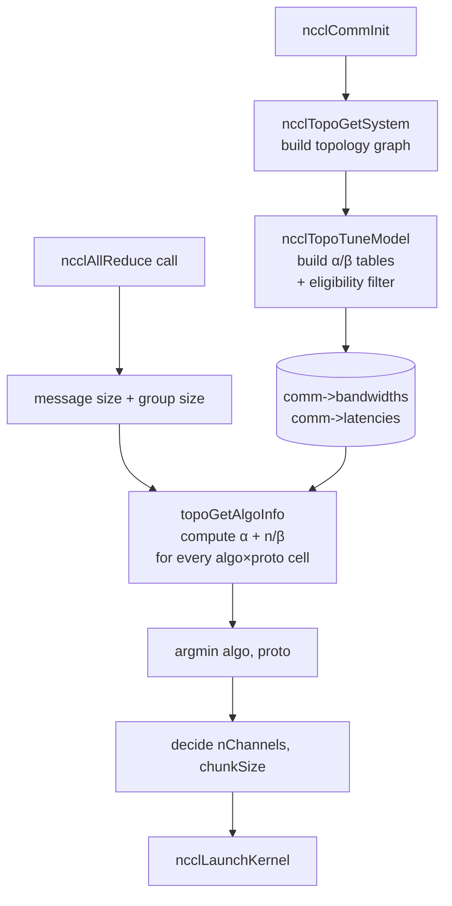

This is a follow-up to [NCCL and Communication Collectives](/posts/nccl-collectives/).

> Code references and function names follow NCCL master as of 2026-04 (v2.30).

## 1. Same Collective, Different Schedule

The same `AllReduce` call is not always run the same way by NCCL. The choice depends on whether the message is 1 MB or 64 MB, whether you have one node or 16 nodes, whether the machine has an NVSwitch. Sometimes ring is picked, sometimes tree, sometimes NVSwitch multicast finishes the whole thing in one shot.

The **semantics** of `AllReduce` are fixed in one line. "Sum every rank's value and give the result to every rank." **How** to perform that is a separate layer. Which schedule is fastest depends on message size, rank count, topology, and hardware.

So every time a collective call comes in, NCCL builds a 7 algorithms x 3 protocols = 21 cell table. For each cell it computes the predicted time using a cost model and picks the cell with the smallest time (argmin, the location of the minimum).

Not every cell is used. Eligibility constraints zero out most of them up front. For AllReduce specifically, only 10 of the 21 cells are actually evaluated (PAT is excluded for AllReduce, removing 3 cells; NVLS, NVLSTree, and CollNet only accept the Simple protocol, removing 8 more). The structure stays the same. Table + argmin.

The goal of this post is to follow how that table is built and how the host, given a tensor size, decides which (algorithm, protocol) pair to launch, all the way through the NCCL master code.

## 2. αβγ Cost Model

A cost model is a way to express the time of one communication as a single formula. It does not give exact measurements, but it is the tool you use to compare algorithm A with algorithm B or to let a library like NCCL pick automatically. NCCL's cost model also reduces to one line in the end (`time = lat + bytes / bw`, see §6.4), and the algorithm-by-algorithm analysis in §4 of this post all sits on top of it.

The standard form splits the time of a single message into three terms.

- $\alpha$: startup latency for one message. Similar to RTT. Microsecond scale.
- $\beta$: per-byte wire transfer cost. Units of 1 / bandwidth.
- $\gamma$: per-byte reduction cost. An addition or similar. Usually small enough next to $\beta$ that it gets dropped.

One $n$-byte message = $\alpha + n\beta$. With reduction, $\alpha + n\beta + n\gamma$. Every formula in this post is written in these variables (αβ goes back to Hockney 1994; the αβγ form was settled in the MPICH analysis by Thakur, Rabenseifner, and Gropp, 2005, which is the standard reference).

In algorithm analysis, two regimes usually divide the picture.

- **Latency-bound**. When the message is small enough that $n\beta$ is negligible, the cost is determined by step count $\times \alpha$. Algorithms with fewer steps ($\log p$) win here.
- **Bandwidth-bound**. When the message is large enough that $n\beta$ dominates, total bytes sent matters more than step count. Algorithms that activate every link in parallel win here.

Algorithm selection is figuring out where you are between these two.

## 3. NCCL Algorithms at a Glance

Before the §4 deep dive, here are the seven algorithms, six topology patterns, and three protocols that NCCL holds in its code.

### 3.1 Seven Algorithms

```c
// src/include/device.h
const char* ncclAlgoStr[NCCL_NUM_ALGORITHMS] = {
  "Tree", "Ring", "CollNetDirect", "CollNetChain", "NVLS", "NVLSTree", "PAT"
};
```

| Algorithm | Core structure | Applicable collectives | Notes |
|---|---|---|---|
| `Ring` | nearest-neighbor pipeline | almost all collectives | per-rank traffic $\sim 2n$ |
| `Tree` | Double Binary Tree (§4.2) | AllReduce only | tree latency + ring BW |
| `CollNetDirect` / `CollNetChain` | NVIDIA SHARP (in-network reduce) | AllReduce, RS, AG | requires IB SHARP NIC |
| `NVLS` | NVSwitch multicast + reduce | AllReduce etc. | Hopper+, requires NVSwitch |
| `NVLSTree` | NVLS + multi-node tree | AllReduce | 2+ nodes |
| `PAT` | Bruck variant (§4.3) | AllGather, ReduceScatter | 2.23+, 1 GPU per node |

Eligibility cuts which collective takes which algorithm early on (`src/graph/tuning.cc::ncclTopoTuneModel`):

```c
// src/graph/tuning.cc
if ((coll == ncclFuncBroadcast || coll == ncclFuncReduce) && a != NCCL_ALGO_RING) continue;
if ((coll == ncclFuncReduceScatter || coll == ncclFuncAllGather)
    && a != NCCL_ALGO_PAT && a != NCCL_ALGO_RING
    && a != NCCL_ALGO_NVLS && a != NCCL_ALGO_COLLNET_DIRECT) continue;
if (coll == ncclFuncAllReduce && a == NCCL_ALGO_PAT) continue;
```

In short: Broadcast / Reduce gets only Ring, AllGather / ReduceScatter gets {Ring, PAT, NVLS, CollNet_Direct}, AllReduce gets everything except PAT.

### 3.2 Six Topology Patterns

Independent of the algorithm, the graph search step (`src/graph/search.cc::ncclTopoCompute`) sees a separate set of topology patterns. Even within Tree, these patterns decide how NIC traffic gets distributed.

```c
// src/include/graph.h
#define NCCL_TOPO_PATTERN_BALANCED_TREE 1   // tree parent + child 1 = GPU A, child 2 = GPU B
#define NCCL_TOPO_PATTERN_SPLIT_TREE 2      // tree parent = GPU A, children = GPU B
#define NCCL_TOPO_PATTERN_TREE 3            // all NIC traffic goes to the same GPU
#define NCCL_TOPO_PATTERN_RING 4
#define NCCL_TOPO_PATTERN_NVLS 5
#define NCCL_TOPO_PATTERN_COLLNET_DIRECT 6
```

BALANCED and SPLIT distribute NIC traffic across two GPUs to relieve PCIe / NVLink bottlenecks. When Tree is picked, graph search separately finds which of these three patterns is the most balanced fit.

### 3.3 Three Protocols

The same algorithm can use one of three wire formats. The data:flag ratio differs.

| Protocol | Cache line | Data efficiency | Suited for |
|---|---|---|---|
| `LL` | 8B (4B data + 4B flag) | 50% | small messages, latency |
| `LL128` | 128B (120B data + 8B flag) | 93.75% | NVLink intra-node, mid-size messages |
| `Simple` | full data + separate fence | ~100% | large messages, throughput |

Idea behind LL and LL128: send the flag next to the data so the receiver can poll readiness with a single word load. No separate PCIe doorbell. The cost is efficiency loss. LL128 uses the NVLink cache line (128B) directly, giving up only 8B per line for the flag, which makes it the sweet spot for NVLink intra-node. The exact enable conditions are in §5.

## 4. Algorithm Deep-dive

Of the seven algorithms in §3, the five that actually get picked in practice (Ring, Tree = Double Binary Tree, PAT, NVLS / NVLS_TREE, CollNet) get cost analysis and NCCL code here.

A first intuition. The same 8-rank AllReduce on the three core NCCL choices gives different round counts and characteristics.

| Algorithm | Rounds | Main characteristic |
|---|---|---|
| Ring | $2(p-1) = 14$ | every link active simultaneously, bandwidth-optimal |
| Double Binary Tree | $\sim 2 \log p = 6$ | log latency + ring-class bandwidth |
| NVLS | 1 | NVSwitch handles multicast + reduce in hardware |

Ring has many steps but each step's message is just $K/p$, small enough to use the wire bandwidth fully. Tree has few steps but spans two phases (reduce-up + broadcast-down), so latency is $2 \log p$. NVLS sends once and the switch takes care of the rest (§4.4).

Small messages favor fewer rounds. Large messages favor smaller per-step bytes. NCCL's selection machine in §6 sits on top of this trade-off.

### 4.1 Ring

Each rank pipelines chunks only with two neighbors. Step count is $O(p)$, which is large, but each step is small and every link is active in parallel, so the wire bandwidth is fully used.

{: width="1080"}
_Figure 1. One iteration of AllReduce on a 4-GPU ring. Each GPU sends its chunk to the neighbor, reduces the received chunk with its partial, and forwards the result. After the RS phase, each rank holds the final reduced value of one chunk; in the AG phase, that chunk goes around the ring once and reaches everyone._

Ring AllReduce consists of two phases, RS + AG (post 1, §3, §5.1). Phase 1 ReduceScatter ($p-1$ steps), phase 2 AllGather ($p-1$ steps). Per-step chunk size $K/p$. Total steps $2(p-1)$, per-rank send bytes $\approx 2K(p-1)/p$.

$$T_{\text{ring}}(K) = 2(p-1)\alpha + \frac{2(p-1)}{p} K\beta + \frac{p-1}{p} K\gamma$$

For large $K$, the $\beta$ term converges to $2K\beta$. This matches the information-theoretic lower bound on AllReduce ($2K$, send your data once and receive the result once). That is what bandwidth-optimal means for ring.

NCCL runs ring as multi-channel. The channel model from post 1 §5.0 carries over directly. `ncclBuildRings` (`src/graph/rings.cc`) builds an independent ring for each channel, and the kernel grid launches as many blocks as there are channels.

### 4.2 Tree (Double Binary Tree, NCCL 2.4+)

Parent-child structure that gathers partial results upward (reduce) or pushes them downward (broadcast). Depth $O(\log p)$ keeps the step count small. The cost of a naive binary tree is:

$$T_{\text{naive tree}} \approx 2 \log p \cdot (\alpha + n\beta + n\gamma)$$

Step count is short, but the weakness is internal node load asymmetry. In a power-of-two binary tree, the root and internal nodes send and receive in proportion to their children, while leaves do it once. Load piles up on the internals and link bandwidth never gets fully used. That is why tree wins on latency but loses to ring on bandwidth.

{: width="640"}
_Figure 2. 8-rank power-of-two binary tree. Internal ranks 0, 4, 2, 6 have children, so their send/receive load is heavy; leaf ranks 1, 3, 5, 7 only send once. This asymmetry is the core problem of §4.2._

NCCL 2.4 solves this with two complementary binary trees (Sanders, Speck, Träff, 2007).

The trick.

- The two trees are built so that if rank $r$ is internal in Tree A, it is a leaf in Tree B.
- Splitting the payload in half across the two trees gives every rank the same send/receive byte count.
- The result: tree latency $\log p$ plus ring-class bandwidth.

{: width="720"}
_Figure 3. NCCL's Double Binary Tree. Tree A on the left and Tree B on the right are complementary. The internal nodes of Tree A (0, 4, 2, 6 in Figure 2) become leaves in Tree B. Splitting the payload in half makes every rank's send/receive load equal, which lets the link bandwidth get fully used._

The code mirrors for even rank counts and shifts for odd (`src/graph/trees.cc::ncclGetDtree`).

```c
// src/graph/trees.cc (excerpt)
ncclResult_t ncclGetDtree(int nranks, int rank,
    int* s0, int* d0_0, int* d0_1, int* parentChildType0,
    int* s1, int* d1_0, int* d1_1, int* parentChildType1) {
  ncclGetBtree(nranks, rank, s0, d0_0, d0_1, parentChildType0);   // Tree A
  if (nranks % 2 == 1) {
    int shiftrank = (rank-1+nranks) % nranks;                     // shift by 1
    int u, d0, d1;
    ncclGetBtree(nranks, shiftrank, &u, &d0, &d1, parentChildType1);
    *s1   = u  == -1 ? -1 : (u +1) % nranks;
    *d1_0 = d0 == -1 ? -1 : (d0+1) % nranks;
    *d1_1 = d1 == -1 ? -1 : (d1+1) % nranks;
  } else {                                                         // mirror: r -> nranks-1-r
    int u, d0, d1;
    ncclGetBtree(nranks, nranks-1-rank, &u, &d0, &d1, parentChildType1);
    *s1   = u  == -1 ? -1 : nranks-1-u;
    *d1_0 = d0 == -1 ? -1 : nranks-1-d0;
    *d1_1 = d1 == -1 ? -1 : nranks-1-d1;
  }
  return ncclSuccess;
}
```

The cost model also encodes "two trees splitting the bandwidth" directly.

```c
// src/graph/tuning.cc, Tree AllReduce latency
if (a == NCCL_ALGO_TREE && coll == ncclFuncAllReduce) {
  comm->latencies[coll][a][p] +=
    2 * ((nRanks/nNodes - 1) * intraLat + log2i(nNodes) * interLat);
}
```

Why the `2 ×`. Just like Ring AllReduce splits into RS + AG, tree AllReduce splits into reduce-up + broadcast-down. The latency of one phase is (intra-node leg) + (inter-node tree $\log_2 N$), and that gets doubled.

### 4.3 PAT, Parallel Aggregated Trees (NCCL 2.23+)

Ring AllGather has latency $(p-1)\alpha$, growing linearly with $p$. PAT solves that. The base is a variant of the Bruck (1997) algorithm. Each round doubles the partner distance (1, 2, 4, 8, ...), and that pattern resembles the FFT (Cooley-Tukey 1965) butterfly diagram closely enough that the distributed computing literature also calls it the butterfly pattern. The NCCL code and docs themselves do not use the term; they just call it PAT.

{: width="720"}
_Figure 4. The Bruck algorithm dataflow. Each round doubles the partner (1, 2, 4, ...) until every rank receives every piece of data. The round count is $\log p$._

The Bruck advantages carry over to PAT: $\log p$ rounds, no power-of-two rank requirement. NCCL's producer / worker kernel structure on top of that brings launch overhead to zero.

{: width="720"}
_Figure 5. NCCL's PAT algorithm at 8 ranks. The Bruck binomial tree pattern, shifted for each rank, runs in parallel for all ranks at once._

#### 4.3.1 Narrow Enable Conditions

Why PAT is rarely seen. `ncclPatEnable` (`src/graph/tuning.cc:209`) requires three conditions all at once.

```c
// src/graph/tuning.cc
NCCL_PARAM(PatEnable, "PAT_ENABLE", 2);
static int ncclPatEnable(struct ncclComm* comm) {
  int patEnable = ncclParamPatEnable();
  if (comm->minCompCap < 60) return 0;             // SM60+ required (CUDA atomics)
  if (patEnable != 2) return patEnable;
  if (comm->nNodes != comm->nRanks) return 0;      // 1 GPU per node only
  if (comm->netDeviceType != NCCL_NET_DEVICE_HOST) return 0;
  return 1;
}
```

`nNodes == nRanks` is the decisive one. PAT is for clusters with one GPU per node. If a node has multiple GPUs (the typical 8-GPU H100 box), PAT does not enable. That is why most people have never seen PAT picked.

When does it matter? Scale-out 1-GPU-per-node clusters, irregular topologies (no NVSwitch), workloads that call AllGather or ReduceScatter often. The NCCL 2.23 release notes emphasize the value at the scale of thousands of nodes.

#### 4.3.2 Cost

```c
// src/graph/tuning.cc
if (a == NCCL_ALGO_PAT
    && (coll == ncclFuncAllGather || coll == ncclFuncReduceScatter)) {
  comm->latencies[coll][a][p] +=
    log2i(nNodes) * (interLat / 3.5)
    + nRanks * 2.8;  // Still a linear part; hopefully we'll manage to remove it at some point.
}
```

The expression is $\log p \cdot \frac{\alpha_{\text{inter}}}{3.5} + p \cdot 2.8$. The first term is the Bruck log-step part, the second is a residual linear part. The code comment ("hopefully we'll manage to remove it") shows that NCCL itself sees this linear term as work in progress.

#### 4.3.3 Kernel: Producer 1 + Worker n

This is where PAT gets interesting. Inside the same CUDA block, one thread drives the algorithm and the others move data.

```c
// src/device/all_gather.h (excerpt, NCCL_ALGO_PAT)
struct ncclPatShmem* shmem = (struct ncclPatShmem*)ncclScratchForWarp(0);

if (tid == nworkers) {
  // 1 algorithm thread. Push next step's source/dst/size into shmem
  PatAGAlgorithm<T> patAlgo(chunkCount*sizeof(T), NCCL_STEPS, ...);
  int step = 0;
  while (1) {
    struct ncclPatStep* ps = shmem->patSteps + (step % NCCL_SHMEM_PAT_STEPS);
    cuda::atomic_ref<int, cuda::thread_scope_block> poll(ps->flags);
    while (poll.load(cuda::memory_order_acquire) != 0) pollCount++;
    patAlgo.getNextOp(ps);
    if (ps->last == 2) break;
    step++;
  }
} else if (tid < nworkers) {
  // n worker threads. Read step descriptor from shmem and run the actual copy
  Primitives<T, RedOp, FanSymmetric<1>, 0, Proto, 0> prims(..., primsModePatAg);
  int step = group;
  while (1) {
    struct ncclPatStep* ps = shmem->patSteps + (step % NCCL_SHMEM_PAT_STEPS);
    cuda::atomic_ref<int, cuda::thread_scope_block> poll(ps->flags);
    while (poll.load(cuda::memory_order_acquire) == 0) pollCount++;
    prims.patCopy(ps, shmem);
    if (tidInGroup == 0) poll.store(0, cuda::memory_order_release);
    if (last) break;
    step += nGroups;
  }
}
```

What to take from this:

- The algorithm progress (which step goes where) and the data movement happen on different threads inside the same kernel, in parallel.
- The algorithm thread writes the plan one step ahead. While workers are running the previous step's copy, the next step's plan is already prepared (slot pipelining).
- The PAT for ReduceScatter sits in `src/device/reduce_scatter.h` with the same structure. Only `prims.patCopy` becomes `prims.patReduce`.

This producer / worker split is what cuts PAT's latency further. Even a log-step algorithm accumulates launch overhead if the host launches per step; NCCL drives the steps inside a single kernel and brings that overhead to zero.

### 4.4 NVLS / NVLS_TREE

In-switch reduction available on Hopper SXM (NVSwitch 4). NVSwitch handles multicast + reduce in hardware, so the GPU sends once and the switch takes care of the rest.

```c
// src/graph/tuning.cc
static const float nvlsEfficiency[NCCL_NUM_COMPCAPS] = {
  0.0f,   // Volta, NVLS not supported
  0.0f,   // Ampere, NVLS not supported
  0.85f,  // Hopper, 85%
  0.74f,  // Blackwell
};
```

Conditions.

- Hopper / Blackwell GPU (compcap 9.0 / 10.0).
- NVSwitch in the system (`system->nodes[NVS].count > 0`).
- At least 2 channels.
- Single node uses `NVLS`; 2+ nodes use `NVLS_TREE` (multi-node tree on top of NVLS).

The simple cost expression is also a hallmark of NVLS.

```c
// src/graph/tuning.cc, NVLS latency
if (a == NCCL_ALGO_NVLS) {
  comm->latencies[coll][a][p] = intraLat;
  if (nNodes > 1) comm->latencies[coll][a][p] += interLat;
}
```

`α × 1` (intra) plus optionally `α × 1` (inter). The $p$ falls out of the formula. That is what NVSwitch multicast does. On 8-GPU H100 / H200 NVSwitch boxes, large AllReduce almost always picks NVLS automatically.

### 4.5 CollNet Direct / Chain

Uses InfiniBand SHARP (Scalable Hierarchical Aggregation and Reduction Protocol). The NIC and IB switch handle reduce in hardware.

```c
// src/graph/tuning.cc
} else if (a == NCCL_ALGO_COLLNET_DIRECT) {
  comm->latencies[coll][a][p] +=
    2 * (std::min(1, (nRanks/nNodes-1)) * intraLat + (nRanks/nNodes-1) * 0.4) + interLat;
} else if (a == NCCL_ALGO_COLLNET_CHAIN) {
  comm->latencies[coll][a][p] += 2 * (nRanks/nNodes-1) * intraLat + interLat;
}
```

Inter-node cost is `interLat × 1`, just one charge, because the inter-node reduction finishes inside the switch. The condition is hardware that supports SHARP and an IB SHARP NIC that NCCL recognizes. Used in HPC clusters with InfiniBand. In RoCE or NVLink environments, NVLS gets picked more often.

## 5. Protocols Simple / LL / LL128

Extending the table from §3.3 down to the code:

```c
// src/device/primitives.h
struct ProtoSimple {  // NCCL_PROTO_SIMPLE = 2
  __device__ static int calcBytePerStep() {
    return ncclShmem.comm.buffSizes[NCCL_PROTO_SIMPLE]/NCCL_STEPS;
  }
};
struct ProtoLL {      // NCCL_PROTO_LL = 0
  // 16B line = 8B data + 8B flag, 50%
  __device__ static int calcBytePerStep() {
    return ncclShmem.comm.buffSizes[NCCL_PROTO_LL]/NCCL_STEPS/2;
  }
};
struct ProtoLL128 {   // NCCL_PROTO_LL128 = 1
  // 128B NVLink line, 120B data, 93.75%
  __device__ static int calcBytePerStep() {
    return (ncclShmem.comm.buffSizes[NCCL_PROTO_LL128]/NCCL_STEPS)
           * NCCL_LL128_DATAELEMS / NCCL_LL128_LINEELEMS;
  }
};
```

LL128 only enables on transports with guaranteed atomicity. The conditions are involved (`src/graph/tuning.cc:486`).

```c
// src/graph/tuning.cc, LL128 enable gating
if (pEnable == 2 && p == NCCL_PROTO_LL128) {
  pEnable = 1;
  if (ncclParamLl128C2c() && minCompCap >= 90) {
    pEnable &= (graphs[a]->typeInter <= PATH_PXN);  // Hopper+ with LL128_C2C=1 allows up to PXN
  } else {
    pEnable &= (graphs[a]->typeInter <= PATH_PXB);  // default cap is PXB
  }
  pEnable &= (graphs[a]->typeIntra <= PATH_NVB);    // intra-node must be NVLink only
  pEnable &= (minCompCap == maxCompCap || minCompCap >= 90);  // uniform compcap, or all >= Hopper
  pEnable &= !(minCompCap < 70 || ...);
}
```

What that says.

- Intra-node has to be NVLink-Bridge or closer (so NVLink direct). PCIe path disables LL128.
- Inter-node has to be PXB or closer (NIC on the same PCIe switch as the GPU). Hopper+ with `NCCL_LL128_C2C=1` extends this up to PXN.
- Compute capability is uniform across ranks, or all of them are at least Hopper.

For the exact path types, see post 1 §4.5. From closest to farthest: NVL > NVB > C2C > PIX > PXB > P2C > PXN > PHB > SYS > NET.

## 6. The Selection Machine

When a user calls a collective (e.g. `ncclAllReduce(buf, ..., count, dtype, op, comm, stream)`), the host has to pick which (algo, proto, nChannels, chunkSize) to launch with. The flow has two stages.

### 6.1 Init: Build the α/β Table

`ncclTopoTuneModel` (`src/graph/tuning.cc:238`) fills two tables at communicator init time, one cell per (collective, algorithm, protocol).

- `comm->bandwidths[coll][algo][proto]` (GB/s)
- `comm->latencies[coll][algo][proto]` (µs)

Bandwidth starts from BFS-measured link bandwidth on the topology, gets adjusted by correction factors like nvlsEfficiency or collnetEfficiency, and is then scaled by per-algorithm step counts and the $(p-1)/p$ factor. Latency is baseLat + hwLat plus the algorithm-specific extras (the formulas in §4).

### 6.2 baseLat / hwLat Verbatim

This table is the input to every cost computation. The actual numbers, copied straight from the source.

```c
// src/graph/tuning.cc, baseLatencies (µs, [algo][proto] = [LL, LL128, Simple])
{
  {  6.8, 14.0,  8.4 }, {  6.6, 14.0,  8.4 },  // Tree, Ring
  {    0,    0,    0 }, {    0,    0,    0 },  // CollNetDirect, CollNetChain
  {    0,    0,    0 }, {    0,    0,    0 },  // NVLS, NVLSTree
  {  8.0,  8.0,  8.0 }                         // PAT
};

// hwLatencies[hw][algo][proto]  (µs, hw = NVLINK / PCI / NET)
{
/* NVLINK */
{ { 0.6,  1.25, 4.0 }, { 0.6,  1.9,  3.4 },   // Tree, Ring
  {   0,     0, 3.7 }, {   0,    0,  2.8 },   // CollNetDirect, Chain
  {   0,     0,  25 }, {   0,    0,   25 },   // NVLS, NVLSTree
  {   0,     0, 4.0 }                       },// PAT
/* PCI */
{ { 1.0,  1.9,  4.0 }, { 1.0,  2.5,  5.7 },
  {   0,     0, 3.7 }, {   0,    0,  2.8 },
  {   0,     0,   0 }, {   0,    0,    0 },
  {   0,     0, 4.0 }                       },
/* NET */
{ { 5.0,  8.5,  14  }, { 2.7,  4.0, 14.0 },
  {   0,     0,  31 }, {   0,    0,   30 },
  {   0,     0,  18 }, {   0,    0, 20.9 },
  {   0,     0,  14 }                       },
};
```

How to read it. `hwLatencies[NCCL_HW_NET][NCCL_ALGO_RING][NCCL_PROTO_SIMPLE] = 14.0` µs. A NIC-hop ring-Simple latency is 14 µs. The same ring on NVLink is 3.4 µs, four times faster.

These numbers feed the §7 numerical example.

### 6.3 Eligibility Filter

The conditions from §3.1, §3.3, and §5, all in the code at once:

```c
// src/graph/tuning.cc::ncclTopoTuneModel (excerpt)
for (int a=0; a<NCCL_NUM_ALGORITHMS; a++) {
  // collective x algorithm compatibility (§3.1)
  if ((coll == ncclFuncBroadcast || coll == ncclFuncReduce)
      && a != NCCL_ALGO_RING) continue;
  if ((coll == ncclFuncReduceScatter || coll == ncclFuncAllGather)
      && a != NCCL_ALGO_PAT && a != NCCL_ALGO_RING
      && a != NCCL_ALGO_NVLS && a != NCCL_ALGO_COLLNET_DIRECT) continue;
  if (coll == ncclFuncAllReduce && a == NCCL_ALGO_PAT) continue;

  for (int p=0; p<NCCL_NUM_PROTOCOLS; p++) {
    // NVLS / NVLS_TREE: Simple only
    if ((a == NCCL_ALGO_NVLS || a == NCCL_ALGO_NVLS_TREE) && p != NCCL_PROTO_SIMPLE)
      continue;
    // PAT: Simple only + its own enable check
    if ((coll == ncclFuncReduceScatter || coll == ncclFuncAllGather)
        && a == NCCL_ALGO_PAT
        && (p != NCCL_PROTO_SIMPLE || ncclPatEnable(comm) == 0))
      continue;
    // LL128 enable (§5)
    // ...
    // surviving cells get bandwidth / latency computed
  }
}
```

Disabled cells get `comm->bandwidths[c][a][p] = 0` (`tuning.cc:504`). The argmin step later drops them.

### 6.4 Per-call Argmin

When a user calls `ncclAllReduce(...)`, a collective task is created and `topoGetAlgoInfo` (`src/enqueue.cc:1940`) takes the message size and group size and finds the argmin in the §1 7 x 3 table.

```c
// src/enqueue.cc (excerpt)
// 1. compute ncclTopoGetAlgoTime for every (algo, proto) cell
for (int a=0; a<NCCL_NUM_ALGORITHMS; a++) {
  for (int p=0; p<NCCL_NUM_PROTOCOLS; p++) {
    float time;
    ncclTopoGetAlgoTime(comm, coll, a, p, nBytes, numPipeOps, &time);
    table[a][p] = (bw == 0) ? -1.0 : time;
  }
}

// 2. argmin
float minTime = FLT_MAX;
int algorithm = NCCL_ALGO_UNDEF, protocol = NCCL_PROTO_UNDEF;
for (int a=0; a<NCCL_NUM_ALGORITHMS; a++)
  for (int p=0; p<NCCL_NUM_PROTOCOLS; p++) {
    if (table[a][p] == NCCL_ALGO_PROTO_IGNORE) continue;
    if (table[a][p] >= 0.0 && table[a][p] < minTime) {
      algorithm = a; protocol = p; minTime = table[a][p];
    }
  }
```

`ncclTopoGetAlgoTime` itself is one line.

```c
// src/graph/tuning.cc:609
*time = lat * latCount + nBytes / (1000 * bw);
```

$T = (\text{lat} \times \text{latCount}) + \frac{\text{nBytes}}{1000 \times \text{bw}}$. NCCL's implementation of $\alpha + n\beta$. `latCount` differs per algorithm (Ring uses `numPipeOps`, others use `DIVUP(numPipeOps, NCCL_MAX_DEV_WORK_BATCH_COLLS)`), and Tree AllReduce gets a per-message-size correction (`treeCorrectionFactor[protocol][logSize]`).

### 6.5 Channel and Chunk Size

Once (algo, proto) is set, the same cost model decides nChannels and chunkSize. CollNet has its own search, NVLS clamps to `comm->nvlsChannels`, and Ring / Tree shrink nc and then nt until `nBytes < nc x nt x threadThreshold` is satisfied.

### 6.6 The Whole Picture



This is the full host-side flow that turns a tensor size into an algorithm and protocol. Build the table once at init, then find the argmin per call given the size.

## 7. Numerical Example

Plugging the formulas above and the §6.2 table into concrete environments shows where ring vs tree vs NVLS actually diverge.

### 7.1 Scenario A: 8 H100 GPUs, Single Node (NVLink + NVSwitch)

Assumptions.

- $p = 8$, single node, NVSwitch.
- NVLink per-direction $\approx 450$ GB/s, aggregate intra-node $B \approx 900$ GB/s.
- $\alpha_{\text{intra}} \approx 1$ µs (one NVLink hop, the PAT entry of the hwLat table).
- baseLat (Tree, Simple) $= 8.4$ µs, baseLat (Ring, Simple) $= 8.4$ µs.

Approximate $T(K)$ per algorithm (Simple protocol):

$$T_{\text{ring}}(K) = 2(p-1)\alpha_{\text{intra}} + \frac{2(p-1)}{p} \cdot \frac{K}{B} \approx 14\,\mu s + \frac{1.75 K}{B}$$

$$T_{\text{tree}}(K) \approx 2 \log_2 p \cdot \alpha_{\text{intra}} + \frac{2K}{B} \approx 6\,\mu s + \frac{2K}{B}$$

$$T_{\text{NVLS}}(K) \approx \alpha_{\text{intra}} + \frac{K}{0.85 B} \approx 1\,\mu s + \frac{1.18 K}{B}$$

| $K$ | Ring | Tree | NVLS |
|---|---|---|---|
| 1 MB | $\sim 16$ µs | $\sim 8$ µs | $\sim 2$ µs |
| 16 MB | $\sim 45$ µs | $\sim 42$ µs | $\sim 22$ µs |
| 256 MB | $\sim 512$ µs | $\sim 575$ µs | $\sim 335$ µs |

NVLS wins at every size on this machine. As expected, large AllReduce on H100 NVSwitch usually goes to NVLS.

### 7.2 Scenario B: 8 nodes x 8 GPU IB (no NVLS)

Assumptions.

- $P = 64$, $p_{\text{node}} = 8$, 8 nodes.
- IB per-direction $\approx 25$ GB/s, $\alpha_{\text{ib}} \approx 5$ µs (a portion of the 14 µs in NET ring Simple in the hwLat table).
- $\alpha_{\text{intra}} \approx 1$ µs.

Cross-node cost dominates, so ring's $2(P-1) = 126$ steps become a real burden. Double Binary Tree compresses that into $2 \log_2 8 = 6$ inter-node steps (the tree latency formula in §4.2).

| $K$ | Ring | Tree (Double Binary) |
|---|---|---|
| 1 MB | $\sim 700$ µs | $\sim 100$ µs |
| 16 MB | $\sim 2.5$ ms | $\sim 1.4$ ms |
| 256 MB | $\sim 35$ ms | $\sim 22$ ms |

Tree is roughly 7x faster at small $K$. Even at large $K$, the Sanders trick keeps tree ahead of ring. This is why NCCL picks Tree often for multi-node AllReduce.

### 7.3 Summary

Selection patterns by scenario.

- **Single-node H100 NVSwitch**: large AllReduce uses NVLS, small ones use Tree or NVLS.
- **Multi-node IB**: large AllReduce uses Tree (Double Binary), small ones use Tree, AllGather and ReduceScatter use Ring or PAT (with 1 GPU per node).
- **InfiniBand SHARP NIC**: CollNetDirect / Chain push Tree out of the picture.

(plot placeholder) Plotting the table above with Python and matplotlib, with ring / tree / NVLS curves on the same axes, makes the two crossovers visible. In scenario A, NVLS is always lowest. In scenario B, the crossover sits between small-$K$ tree and large-$K$ ring.

That is the analysis. The actual measurements look like this. Here is how NCCL 2.4's Double Binary Tree scaled on Summit up to 24,576 GPUs.

{: width="640"}
_Figure 6. Bus bandwidth stays nearly flat all the way to 24K GPUs on Summit. The combination of Double Binary Tree and multi-channel ring keeps bandwidth utilization high even at large scale._

{: width="640"}
_Figure 7. Latency from the same measurement. The curve is $O(\log p)$ all the way to 24K GPUs. With pure ring the line would be $O(p)$ and would explode; the log-step algorithms (Tree, PAT) take care of that._

That is the data showing why, with small messages and a huge GPU count, ring alone makes latency blow up. Double Binary Tree for AllReduce and PAT for AllGather and ReduceScatter exist to solve exactly this.

## 8. Environment Variables, Determinism, Debugging

### 8.1 NCCL_ALGO / NCCL_PROTO Override

Forcing the automatic choice.

```bash
# Ring + CollNetDirect for everything, Tree + CollNetDirect for AllReduce only
NCCL_ALGO="ring,collnetdirect;allreduce:tree,collnetdirect"

# Allow everything except LL128
NCCL_PROTO="^LL128"
```

The flow: `parseList` builds a bitmask, and disabled cells get bandwidth zeroed (`tuning.cc:504`). The argmin then drops them.

### 8.2 Determinism

A different reduction tree gives a different floating-point summation order, which changes the low bits.

```bash
NCCL_ALGO=Tree
NCCL_PROTO=Simple
```

Pinning algorithm and protocol with these makes the reduction order deterministic. In bf16 environments the difference can be non-trivial, and this pinning is common when verifying reproducibility.

### 8.3 NCCL_DEBUG_SUBSYS=TUNING

The most direct debug tool. NCCL prints one line at every collective dispatch.


```c
// src/enqueue.cc
INFO(NCCL_TUNING, "%s: %ld Bytes -> Algo %s proto %s channel{Lo..Hi}={%d..%d}",
  ncclFuncToString(task->func),
  task->count * ncclTypeSize(task->datatype),
  ncclAlgoToString(task->algorithm),
  ncclProtoToString(task->protocol),
  devWork->channelLo, devWork->channelHi);
```


Enable.

```bash
export NCCL_DEBUG=INFO
export NCCL_DEBUG_SUBSYS=TUNING
```

Sample output.

```
NCCL INFO AllReduce: 4194304 Bytes -> Algo Tree proto Simple channel{Lo..Hi}={0..7}
NCCL INFO AllGather: 1048576 Bytes -> Algo Ring proto LL128 channel{Lo..Hi}={0..3}
```

AllReduce not going to NVLS on an 8-GPU H100? Check the channel count and NVS detection first with `NCCL_DEBUG_SUBSYS=GRAPH`. PAT not showing up? Almost always `nNodes != nRanks`.

PyTorch profiler trace kernel names carry the same information: `ncclKernel_AllReduce_RING_LL_Sum_bfloat16` and so on.

---

## NCCL Source

| Topic | File | Function / region |
|---|---|---|
| Algorithm enum | `src/include/device.h` | `ncclAlgoStr[]` |
| Pattern enum | `src/include/graph.h` | `NCCL_TOPO_PATTERN_*` |
| Ring construction | `src/graph/rings.cc` | `ncclBuildRings` |
| Double Binary Tree construction | `src/graph/trees.cc` | `ncclGetDtree`, `ncclGetBtree` |
| Topology pattern search | `src/graph/search.cc` | `ncclTopoCompute` |
| Build α/β tables | `src/graph/tuning.cc` | `ncclTopoTuneModel` |
| baseLat / hwLat | `src/graph/tuning.cc` | `baseLatencies`, `hwLatencies` |
| NVLS efficiency | `src/graph/tuning.cc` | `nvlsEfficiency` |
| LL128 enable | `src/graph/tuning.cc` | `pEnable` block |
| PAT enable | `src/graph/tuning.cc` | `ncclPatEnable` |
| Cost model formula | `src/graph/tuning.cc` | `ncclTopoGetAlgoTime` |
| Argmin selection | `src/enqueue.cc` | `topoGetAlgoInfo` |
| Tuning log line | `src/enqueue.cc` | `INFO(NCCL_TUNING, ...)` |
| PAT AllGather kernel | `src/device/all_gather.h` | `RunWorkColl<NCCL_ALGO_PAT>` |
| PAT ReduceScatter kernel | `src/device/reduce_scatter.h` | same structure |
| Ring AllReduce kernel | `src/device/all_reduce.h` | `runRing` |
| Protocol definitions | `src/device/primitives.h` | `ProtoSimple`, `ProtoLL`, `ProtoLL128` |

## Reference

- Hu, Z. et al. "Demystifying NCCL: An In-depth Analysis of GPU Communication Protocols and Algorithms." arXiv:2507.04786, 2026.
- Sanders, P., Speck, J., Träff, J.L. "Full Bandwidth Broadcast, Reduction and Scan with Only Two Trees." PVM/MPI, 2007.
- Thakur, R., Rabenseifner, R., Gropp, W. "Optimization of Collective Communication Operations in MPICH." IJHPCA, 2005.
- Bruck, J. et al. "Efficient Algorithms for All-to-All Communications in Multiport Message-Passing Systems." IEEE TPDS, 1997.
- Jeaugey, S. "PAT: a new algorithm for all-gather and reduce-scatter operations at scale." arXiv:2506.20252, 2025.
- <https://docs.nvidia.com/deeplearning/nccl/>
- <https://developer.nvidia.com/blog/massively-scale-deep-learning-training-nccl-2-4/>
- <https://developer.nvidia.com/blog/doubling-all2all-performance-with-nvidia-collective-communication-library-2-12/>
- <https://github.com/NVIDIA/nccl>
- Post 1: [NCCL and Communication Collectives](/posts/nccl-collectives/)
